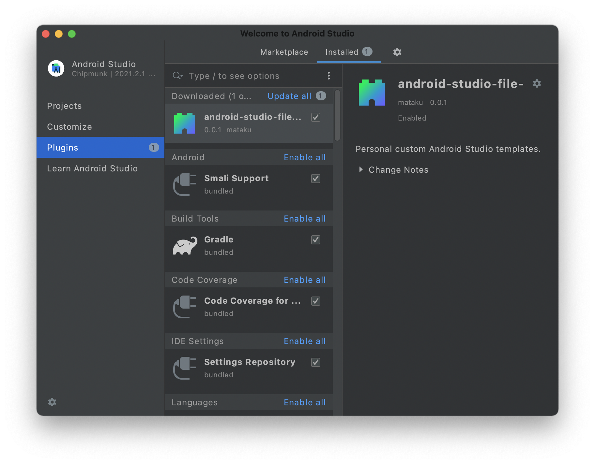

# android-studio-file-templates

<!-- Plugin description -->
Personal custom Android Studio templates. 

<!-- Plugin description end -->

## Installation

1. Run `./gradlew buildPlugin`
2. Launch Android Studio
3. Choose Preferences -> Plugins
4. Tap gear icon ⚙️ and choose `Install plugin from Disk`
5. Select jar in `$PROJECT_ROOT/build/libs` generated in step 1
6. Restart Android Studio

## Development

It is convenient to use the runIde gradle task as restarting Android Studio every time after installing plugin is so hard.

1. Edit some codes
2. Run `./gradlew runIde`
3. Try plugin

---
Plugin based on the [IntelliJ Platform Plugin Template][template].

[template]: https://github.com/JetBrains/intellij-platform-plugin-template
